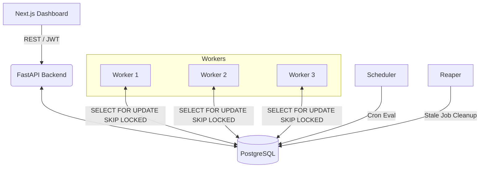

# System Architecture

The Distributed Job Scheduler is composed of several independent services designed for scalability, statelessness, and fault tolerance.

## Components

### 1. Next.js Frontend (`/frontend`)
- A React-based web application providing a UI for users to monitor jobs, manage queues, and view scheduled tasks.
- Communicates exclusively with the FastAPI Backend via REST using JWT tokens for authentication.
- Designed to be completely stateless; all persistent state lives in Postgres.

### 2. FastAPI Backend (`/backend/app`)
- Provides the REST API for both the Dashboard (via JWT) and external API integrations (via API Keys).
- Handles incoming job submissions, queue configurations, and user management.
- Does **not** execute jobs. Its role is strictly to read/write state to PostgreSQL.

### 3. Worker Processes (`/worker`)
- Independent Python scripts running in a continuous loop.
- **Stateless:** Workers do not coordinate directly with each other or with the backend. 
- **Horizontal Scaling:** You can spin up 1, 3, or 100 worker containers. They scale seamlessly.
- **Claiming Logic:** Workers compete to claim `QUEUED` jobs by executing a concurrency-safe database query.
- When a job is claimed, the worker executes it, updates the job's status, and manages retries if failures occur.

### 4. Scheduler Service (`/backend/app/scheduler.py`)
- A singleton background service (running via `backend/scheduler/main.py`).
- Responsible for sweeping the `scheduled_jobs` table.
- When a cron expression is due, the Scheduler creates a tangible execution in the `jobs` table and advances the schedule's `next_run_at` pointer.
- Like the API, it never executes job logic directly.

### 5. PostgreSQL Database
- The central source of truth for the entire system.
- Acts as the queue broker using transactional locking.

## Data Flow & Lifecycle

1. **Submission**: User submits a job via the API. Backend inserts a row into the `jobs` table with `status="QUEUED"`.
2. **Claiming**: Workers continuously poll Postgres. When a worker finds a `QUEUED` job, it atomically locks it and sets `status="CLAIMED"`.
3. **Execution**: The worker sets `status="RUNNING"`, performs the work, and then sets `status="COMPLETED"`.
4. **Failure**: If an exception occurs, the worker evaluates the retry policy, bumps the attempt count, sets `status="QUEUED"`, and computes a `next_retry_at` delay.
5. **DLQ**: If all attempts are exhausted, the job is marked `FAILED` and moved to the Dead Letter Queue.
