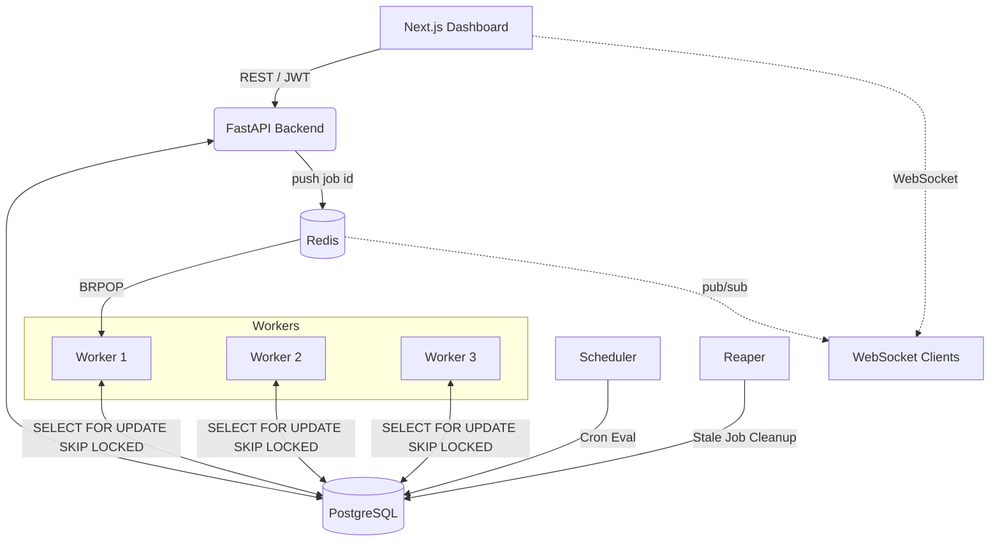

# System Architecture

The Distributed Job Scheduler is composed of several independent services designed for scalability, statelessness, and fault tolerance. Postgres is the durable source of truth for all state; Redis is used only for fast dispatch signalling, rate limiting, and pub/sub — never as the record of whether a job is actually claimed.

## Components

### 1. Next.js Frontend (`/frontend`)
- A React-based web application providing a UI for users to monitor jobs, manage queues, and view scheduled tasks.
- Communicates with the FastAPI Backend via REST (JWT-authenticated) and optionally via a WebSocket connection for live job-status push.
- Designed to be completely stateless; all persistent state lives in Postgres.

### 2. FastAPI Backend (`/backend/app`)
- Provides the REST API for both the Dashboard (via JWT) and external API integrations (via API Keys).
- Handles incoming job submissions, queue configurations, and user management.
- On job creation, pushes the new job's ID onto a Redis list as a fast dispatch signal, and publishes job-status changes to a Redis pub/sub channel for WebSocket clients.
- Does **not** execute jobs itself. Its role is to read/write state to PostgreSQL and signal workers via Redis.

### 3. Worker Processes (`/worker`)
- Independent Python scripts running in a continuous loop.
- **Stateless:** Workers do not coordinate directly with each other or with the backend.
- **Horizontal Scaling:** You can spin up 1, 3, or 100 worker containers. They scale seamlessly.
- **Claiming Logic:** A worker pops a job ID from the Redis dispatch list via `BRPOP`, then performs the durable, atomic claim against Postgres using `SELECT ... FOR UPDATE SKIP LOCKED`. Postgres — not Redis — is what actually determines whether a job is claimed.
- **Heartbeats:** While executing, a worker updates the job's `last_heartbeat` every 5 seconds so the Reaper can detect a crash.
- **Graceful shutdown:** Workers intercept `SIGTERM`/`SIGINT`, stop claiming new jobs, and let any in-flight job finish before exiting.

### 4. Scheduler Service (`/backend/app/scheduler.py`)
- A singleton background service.
- Responsible for sweeping the `scheduled_jobs` table.
- When a cron expression is due, the Scheduler creates a concrete execution in the `jobs` table and advances the schedule's `next_run_at` pointer.
- Like the API, it never executes job logic directly.

### 5. Reaper Service (`/backend/app/reaper.py`)
- Polls for jobs stuck in `RUNNING` with no heartbeat update in the last 15 seconds — indicating the worker that claimed them crashed.
- Recovers these jobs using the same retry-or-DLQ logic as a normal execution failure, so a crashed worker never leaves a job silently stuck.

### 6. PostgreSQL Database
- The central source of truth for the entire system: job state, queue configuration, and tenant data.
- Acts as the transactional claim authority via row-level locking, regardless of how a worker was signalled to look.

### 7. Redis
- Used for exactly three things: a fast dispatch signal (list + `BRPOP`) so workers don't need to poll Postgres continuously, a rate limiter for job-submission endpoints, and a pub/sub channel that pushes live job-status updates to connected WebSocket clients.
- **Not persisted.** If Redis restarts, or a dispatch push is issued but not yet consumed, the affected job still exists correctly in Postgres as `QUEUED` — but no reconciliation process currently rescans Postgres directly to rediscover it. This trade-off is accepted for the current timeline; see `DESIGN-DECISIONS.md` for the reasoning and the recommended next step (Redis persistence + a reconciliation sweep, or falling back to direct Postgres polling).

## Data Flow & Lifecycle

1. **Submission**: User submits a job via the API. Backend inserts a row into the `jobs` table with `status="QUEUED"` and pushes the job's ID onto the Redis dispatch list.
2. **Claiming**: A worker pops a job ID from Redis via `BRPOP`, then atomically locks and claims the corresponding row in Postgres, setting `status="CLAIMED"`.
3. **Execution**: The worker sets `status="RUNNING"`, sends periodic heartbeats, performs the work, and then sets `status="COMPLETED"`.
4. **Failure**: If an exception occurs, the worker evaluates the retry policy, bumps the attempt count, sets `status="QUEUED"`, and computes a `next_retry_at` delay.
5. **Crash Recovery**: If a worker dies mid-execution, the Reaper detects the stale heartbeat and applies the same retry-or-DLQ logic on the job's behalf.
6. **DLQ**: If all attempts are exhausted, the job is marked `FAILED` and moved to the Dead Letter Queue.
