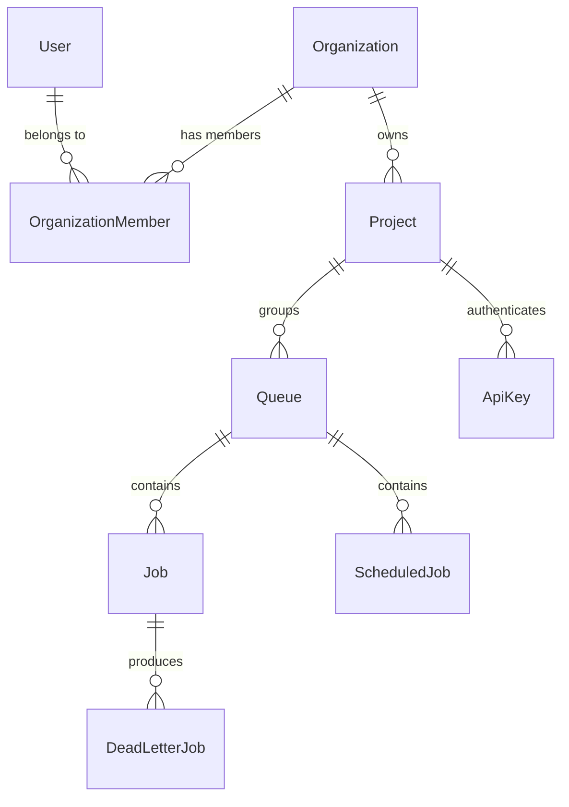

# Database Schema & Concurrency

The system leverages PostgreSQL as both a persistence layer and a message broker.

## Concurrency Control

Instead of relying on an external queue broker like Redis or RabbitMQ, the system uses Postgres row-level locking:

```sql
SELECT * FROM jobs 
WHERE status = 'QUEUED'
FOR UPDATE SKIP LOCKED
LIMIT 1;
```

- `FOR UPDATE`: Locks the rows returned by the query so that no other transaction can read or write to them until the current transaction completes.
- `SKIP LOCKED`: If a row is already locked by another worker's `FOR UPDATE` query, Postgres silently skips it rather than blocking the query and waiting for the lock to be released.

This combination allows dozens of worker processes to rapidly pull jobs off the queue in parallel without ever claiming the same job twice, entirely bypassing race conditions.

## Multi-Tenancy Hierarchy

The domain models are structured to strictly enforce data isolation across organizations.



### Hierarchy Rules
1. A **User** belongs to an **Organization**.
2. An **Organization** owns multiple **Projects**.
3. A **Project** owns multiple **Queues**.
4. Every **Job** and **ScheduledJob** belongs to exactly one **Queue**.
5. Consequently, all Jobs are implicitly scoped to a specific Project.

### Unique Constraints
Queues enforce a unique name *per project*. A global index on `(project_id, name)` ensures that "Project A" and "Project B" can both have a queue named "default" without conflict.

## Schema Provisioning

The database schema is provisioned at runtime via `Base.metadata.create_all(bind=engine)` in [`main.py`](../backend/app/main.py), which runs on every backend startup. This creates any missing tables directly from the SQLAlchemy model definitions — no manual migration step is required.

The Alembic migration files in `backend/alembic/versions/` are retained as a historical record of the schema's evolution across development phases (e.g., adding queues, adding multi-tenancy columns, adding the DLQ table). They document the *why* and *when* of each schema change and are useful context for understanding design decisions. However, `create_all()` is what actually provisions the database for this submission. Running `alembic upgrade head` against a `create_all()`-built database is not necessary and may behave unpredictably since Alembic's version-tracking table won't be in sync.

> Alembic migrations were used during phased development; for the final submission, schema creation was simplified to `create_all()` at startup to eliminate migration-state risk close to the deadline.

