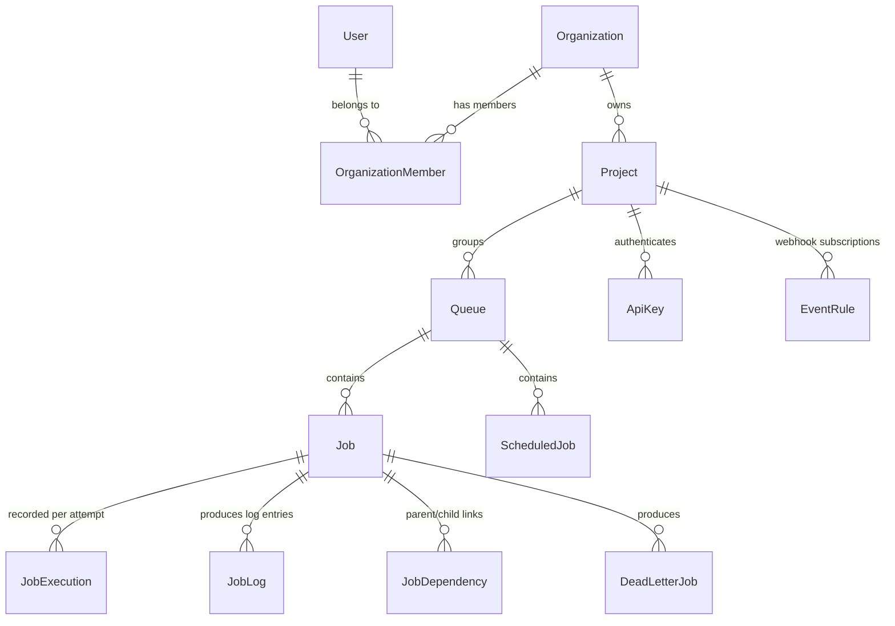

# Database Schema & Concurrency

The system uses PostgreSQL as the durable persistence layer and source of truth for all job and tenant state, with Redis used for two specific, non-critical-path purposes: fast job dispatch signalling and pub/sub broadcast for WebSocket updates (see below).

## Concurrency Control

Job dispatch uses a hybrid model. On creation, a job is pushed onto a Redis list as a fast signal; a worker pops a job ID via `BRPOP` and then performs the durable, atomic claim against Postgres using row-level locking:

```sql
SELECT * FROM jobs
WHERE status = 'QUEUED'
FOR UPDATE SKIP LOCKED
LIMIT 1;
```

- `FOR UPDATE`: Locks the rows returned by the query so that no other transaction can read or write to them until the current transaction completes.
- `SKIP LOCKED`: If a row is already locked by another worker's `FOR UPDATE` query, Postgres silently skips it rather than blocking the query and waiting for the lock to be released.

Postgres remains the source of truth for whether a job is actually claimed — the Redis push only signals a worker to look, it never marks a job as claimed on its own. This combination allows multiple worker processes to pull jobs off the queue in parallel without ever claiming the same job twice.

**Trade-off, stated plainly:** the Redis instance used for dispatch is not configured with persistence. If Redis restarts, or a push is issued but not yet consumed at the moment of a restart, the affected job remains correctly stored in Postgres as `QUEUED` but has no corresponding entry in the Redis list, and no reconciliation process currently rescans Postgres directly for that case. The job would sit undiscovered until such a reconciliation step is added, or until a component that does poll Postgres directly (if any) picks it up. This is an accepted trade-off for the current timeline, not an oversight — enabling Redis AOF persistence and/or adding a periodic Postgres reconciliation sweep is the natural next step for a production deployment.

## Multi-Tenancy Hierarchy

The domain models are structured to strictly enforce data isolation across organizations.



### Hierarchy Rules

1. A **User** belongs to an **Organization**.
2. An **Organization** owns multiple **Projects**.
3. A **Project** owns multiple **Queues**, **ApiKeys**, and **EventRules**.
4. Every **Job** and **ScheduledJob** belongs to exactly one **Queue**.
5. Consequently, all Jobs are implicitly scoped to a specific Project via their Queue — not scoped directly, to keep a single source of truth for ownership.
6. Each **Job** accumulates its own **JobExecution** rows (one per attempt, preserving worker/timestamps/error history even though the parent job's `status` column is overwritten on each transition) and **JobLog** entries.
7. **JobDependency** links a child Job to one or more parent Jobs, for dependency-gated execution.

### Unique Constraints

Queues enforce a unique name *per project*. A composite unique index on `(project_id, name)` ensures that "Project A" and "Project B" can both have a queue named "default" without conflict. Job `idempotency_key`, where provided, is similarly enforced unique per queue.

## Schema Provisioning

The database schema is provisioned at runtime via `Base.metadata.create_all(bind=engine)` in [`main.py`](../backend/app/main.py), which runs on every backend startup. This creates any missing tables directly from the SQLAlchemy model definitions — no manual migration step is required.

The Alembic migration files in `backend/alembic/versions/` are retained as a historical record of the schema's evolution across development phases (e.g., adding queues, adding multi-tenancy columns, adding the DLQ table). They document the *why* and *when* of each schema change and are useful context for understanding design decisions. However, `create_all()` is what actually provisions the database for this submission. Running `alembic upgrade head` against a `create_all()`-built database is not necessary and may behave unpredictably since Alembic's version-tracking table won't be in sync.

> Alembic migrations were used during phased development; for the final submission, schema creation was simplified to `create_all()` at startup to eliminate migration-state risk close to the deadline.
